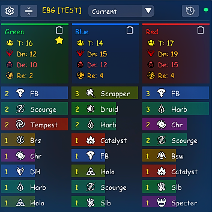
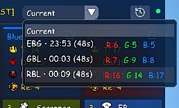
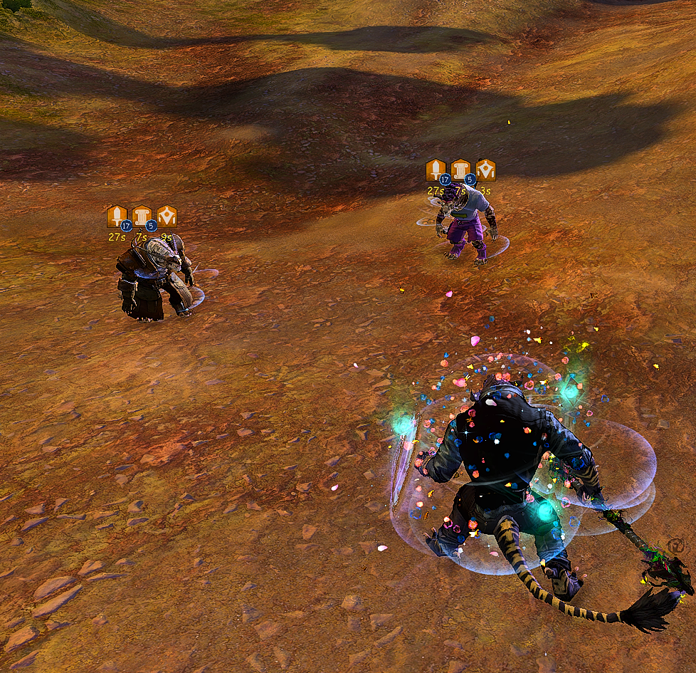
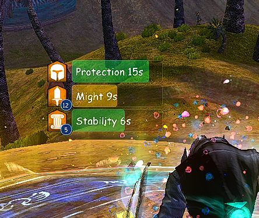
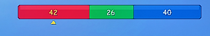
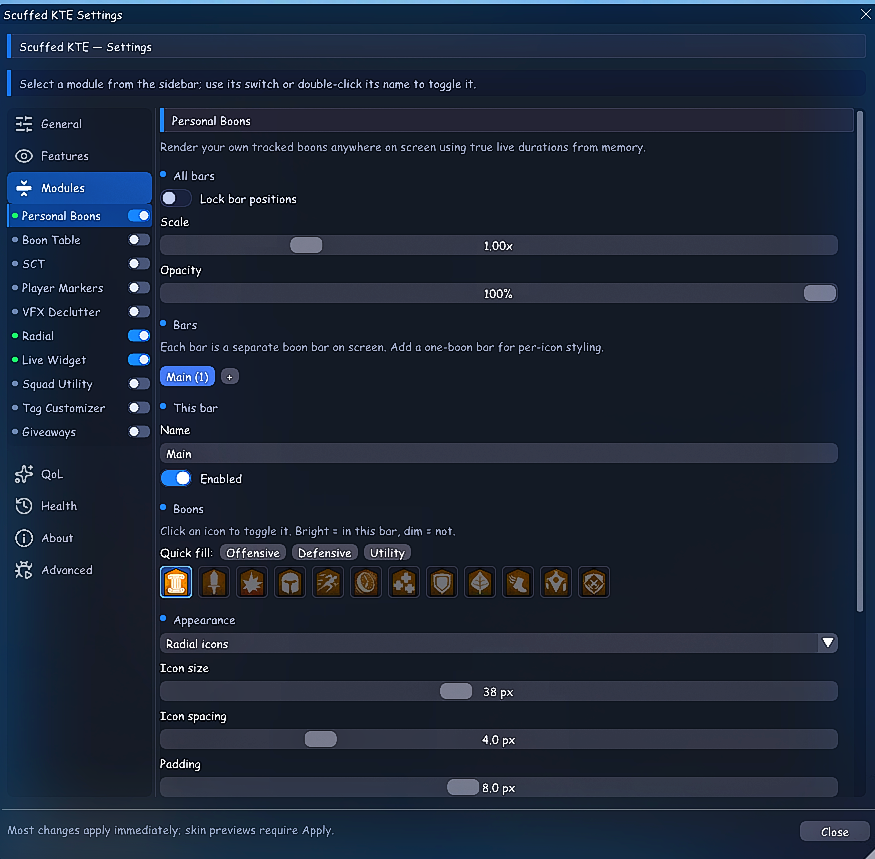
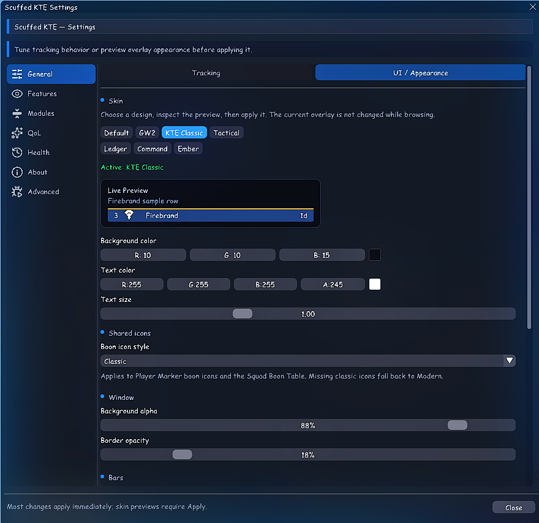

# Scuffed KTE (Know Thy Enemy)

Scuffed KTE is a [Nexus](https://raidcore.gg/Nexus) addon for Guild Wars 2. It combines a combat-gated WvW session tracker with optional squad, overlay, and quality-of-life tools.

## Choose one build

| Build | Included |
| --- | --- |
| **Lite** | The conservative, compliance-first edition: the core KTE combat-session tracker and history. |
| **Standard** | Everything in Lite, plus accessibility and quality-of-life tools for boons, combat text, player markers, squad utilities, visual declutter, tag visibility, radial/cursor controls, and more. It also includes the optional Live Widget described below. |

Install only one build. Standard and Lite can be swapped later without intentionally discarding your existing settings.

## Core tracker

- Tracks the fight you are actually participating in.
- Enemy admission is combat-gated: an enemy appears after a real combat interaction involving you.
- Shows anonymised profession and elite specialisation composition, downs, deaths, rerunners, and session history.
- Does not display enemy character/account names, positions, routes, or movement.
- Does not target, move, cast, issue inputs, or play the game for you.
- Gameplay systems suspend and hide in structured PvP, Guild Wars 2's rated competitive mode. The settings window remains available.

| Combat tracker | Session history |
| --- | --- |
|  |  |

## Standard and the Live Widget

Most Standard modules reorganise information already shown by the game UI, available through ArcDPS, or observed in combat events. Their purpose is accessibility, clarity, and reduced visual noise.

| Player Markers | Personal Boon Bar |
| --- | --- |
|  |  |

The **Live Widget is the exception**. It is disabled by default and counts nearby, non-stealthed players by team. Because it can count a player who is occluded by terrain or a wall, it may reveal more than is currently visible on screen. Many players find the overview useful, but the competitive advantage concern is valid and the feature is a likely candidate for removal. Choose Lite, or leave the widget disabled, if you want the most conservative edition.

| Standard modules | Appearance and skin settings |
| --- | --- |
|  |  |

## Installation

1. Install [Nexus](https://raidcore.gg/Nexus).
2. Close Guild Wars 2.
3. Choose either `Standard/scuffed_kte.dll` or `Lite/scuffed_kte_lite.dll`.
4. Place the chosen DLL in the Nexus `addons` folder.
5. Launch the game and enable KTE in Nexus.

Do not install both DLLs at the same time. When changing editions, remove or replace the previous KTE DLL first.

After the initial installation, you can switch between Lite and Standard from KTE's [**Health** tab](images/health-version-switch.png). Nexus downloads the selected edition and applies it after a restart, while retaining your KTE settings.

## Third-party program policy

Lite is designed as the strict compliance-focused build: combat-gated and anonymised. Standard adds accessibility and quality-of-life modules, including the Live Widget caveat above.

ArenaNet does not certify individual addons; third-party programs are used at the account holder's own risk and remain subject to ArenaNet's discretion. See the official [Policy: Third-Party Programs](https://help.guildwars2.com/hc/en-us/articles/360013625034-Policy-Third-Party-Programs).

## For ArenaNet

If you represent ArenaNet and believe that any part of KTE should be changed or removed, please contact me through the project page or KTE's in-game feedback section. I will review the concern and make any necessary changes.

## Notes

- This is an unofficial community addon and is not endorsed by ArenaNet, Nexus.
- Guild Wars 2 updates can temporarily break third-party addons. Disable or remove the DLL if it causes instability.
- Public releases are binary-only.
- Support and feedback are available through KTE's in-game feedback page.
